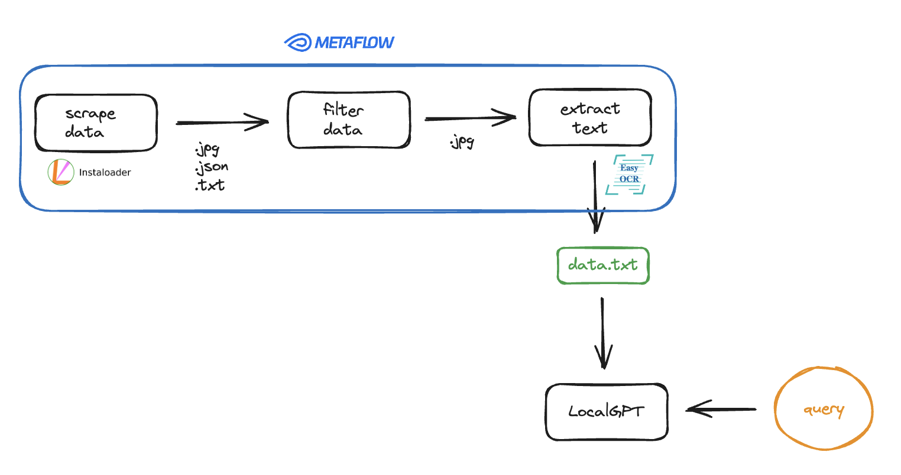
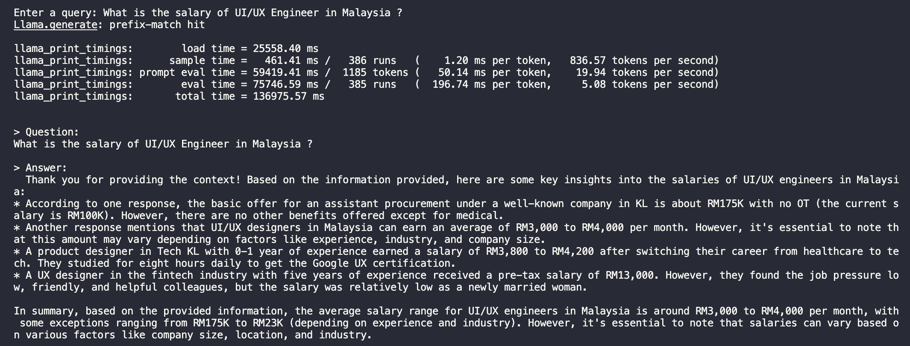

# MalaysianPayGap LLM using LocalGPT

A sandbox approach to create an end-to-end flow using cutting edge tools & techs. For demo purpose, I've crawled data from Jan 2018 -  Jan 2024 from `malaysianpaygap` Instagram profile.

## Prerequisites
- Python 3.10
- Metaflow (https://docs.metaflow.org/getting-started/install)
- Instaloader (https://github.com/instaloader/instaloader)
- EasyOCR (https://github.com/JaidedAI/EasyOCR)
- LocalGPT (https://github.com/PromtEngineer/localGPT)

## To Reproduce
- STEP 1: Install all dependencies
- STEP 2: Run `python process_flow.py run --profile <TARGET_PROFILE_NAME> --start_date "<START_DATE>" --end_date "<END_DATE>"` | date format: `YYYY-MM-DD (2024-02-18)`
- STEP 3: Copy `data.txt` to LocalGPT's `SOURCE_DOCUMENTS` directory
- STEP 4: Setup (follow github guidelines), Ingest & Run LocalGPT!

## Demo Screenshot

## Others
- Metaflow Sandbox: https://outerbounds.com/sandbox/
